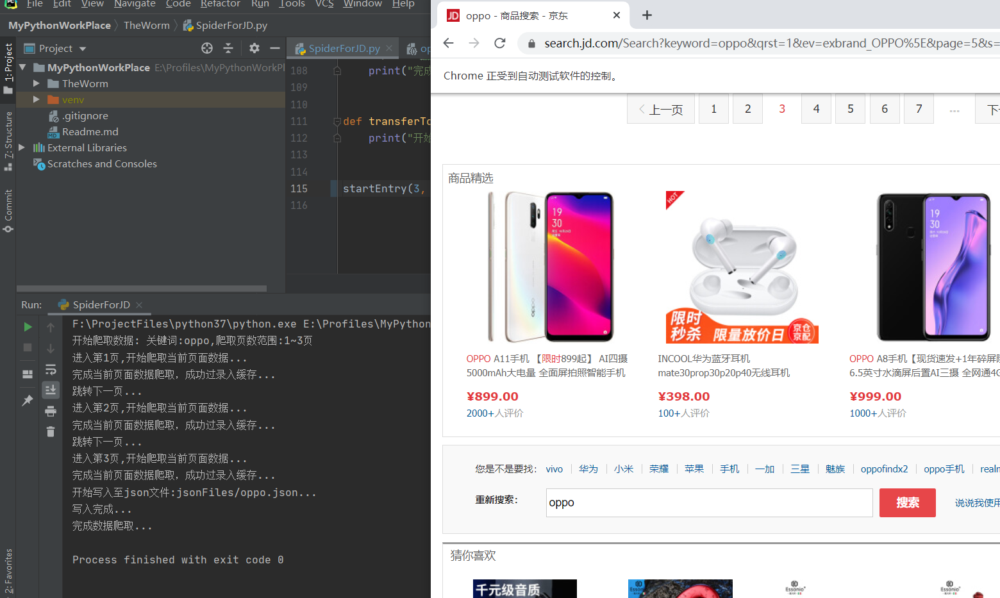

# A web spider for collecting the information of specified merchs
## Brief introduction:
This application aims to provide a spider for collecting the specified merch's information from [JD.com](www.jd.com). The user can search their own merch's information
according to the inputs: "**keywords**", "**pageRange**". The detail about each parameter will be illustrated below. 
Moreover, the procedures of the application can be divided into three phases, the first phase will collect the merch's information based on user's requirements, then the result will be stored at a **json** file, and users can use the extended application for transferring the **json** file into an **Excel** file. 
## How to start
The procedures about how to start the application will be presented step by step as follow
### Prerequisite and environment preparation
- Environment preparation
    - python 3.7
    - pycharm
    - selenium
    - Chromedriver
    - extend packages
        - xlrd
        - xlutils
### Run the app
Star from SpiderForJD.py  
`def startEntry(pageRange, keyWords, jsonFileName)` input three parameter according to your own requirements:
- pageRange: The number of the pages that you want to collect, for instance, if you want to collect the information from page 1 to page 2, you should input the parameter as 2.
- keyWords: Input the merch's keywords such as 'iphone', 'television','HUAWEI' etc.
- jsonFileName: The name of the data storing json file.
#### Demonstration
 - The screenshot while collecting the data 
 - The screenshot of the collected json data 
 - The screenshot of the data after writing into excel file 

